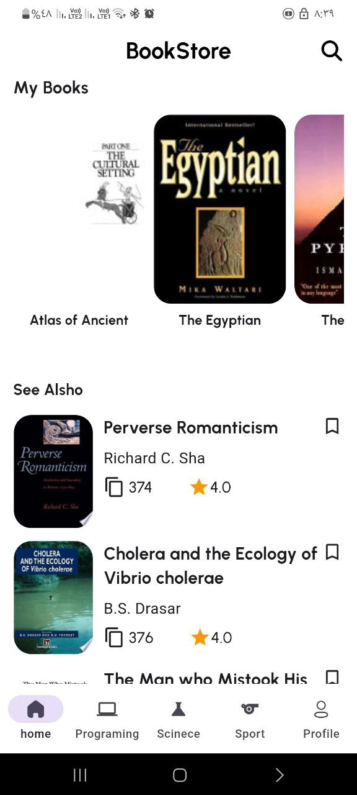
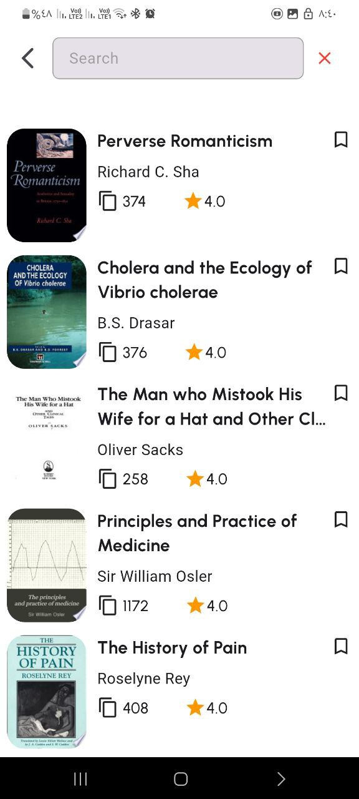
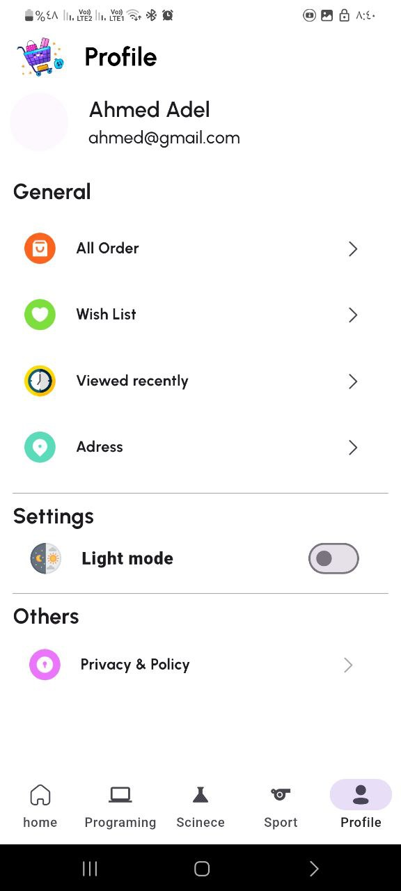

# 📚 **Book App – Flutter Application**

A modern Flutter mobile application for browsing and exploring books with categories, search, pagination, and clean UI.

---

## 🖼 **App Screenshots**

Add your app images here in Canva by replacing the placeholders:

## App Screenshots

| Home Screen                                 | Category Screen                                     |
| ------------------------------------------- | --------------------------------------------------- |
|  |  |

| Book Details                                     | Search Screen                                   | Profile Screen                                    |
| ------------------------------------------------ | ----------------------------------------------- | ------------------------------------------------- |
|  |  |  |

---

## 🚀 **Features**

* Browse books in multiple categories (Programming, Science, Sports, Egypt...)
* Search bar with instant filtering
* Pagination for infinite scroll
* MVVM architecture
* Bloc/Cubit state management
* URL Launcher to open book links
* Clean navigation using go_router
* Dependency Injection with get_it

---

## 📦 **Packages Used**

```
bloc: ^8.1.2
cupertino_icons: ^1.0.2
curved_navigation_bar: ^1.0.3
dartz: ^0.10.1
dio: ^5.4.0
equatable: ^2.0.5
fancy_shimmer_image: ^2.0.3
flutter_bloc: ^8.1.3
flutter_getit: ^1.2.1
flutter_iconly: ^1.0.2
flutter_launcher_icons: ^0.14.4
font_awesome_flutter: ^10.6.0
get_it: ^7.6.4
go_router: ^12.1.3
shared_preferences: ^2.2.2
url_launcher: ^6.3.2
```

---

## 🏗 **Architecture – MVVM**

```
lib/
 └── features/
      └── home/
           ├── data/
           └── presentation/
 └── core/
      ├── di/
      ├── network/
      ├── utils/
      ├── error/
      ├── function/
      └── widgets/
```

---

## ▶ **Launch Book URL**

```dart
launchUrl(Uri.parse(bookUrl));
```

---

## 🛠 **Run the App**

```bash
flutter pub get
flutter run
```

